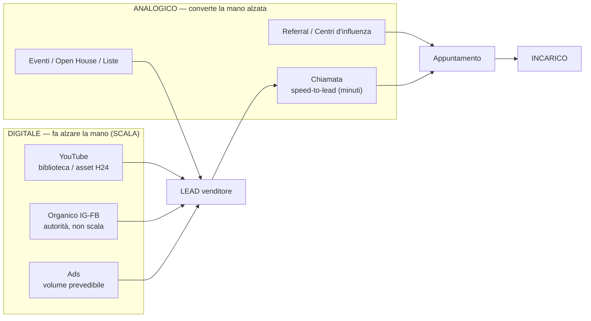
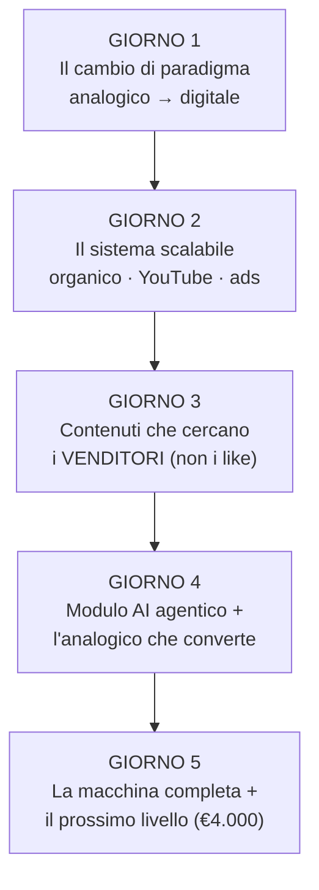
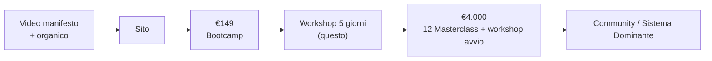

# Workshop 5 Giorni — "Dall'Analogico al Digitale (passando per l'Analogico)"

> Piano operativo per il workshop online di 5 giorni · 90 min/giorno.
> Output di `regista-ecosistema` (cantiere A) — pronto da passare a Claude Design
> per le slide. NON sono le slide: è la struttura + i diagrammi + il playbook €4.000.
> Relatori: **Giuseppe Castiello** (digitale + parte mindset) · **Antonella
> Sorrentino** (analogico) · **Vincenzo Romano** (mindset del cambiamento).
> Fonti: tesi Mike Sherrard (video 2026 digital/analog), slide Drive esistenti,
> `ecosistema-as.md`, tono "Negazione Costruttiva".

---

## 0. La grande idea (il filo dei 5 giorni)

**Il mercato immobiliare ha fatto una scalata: da analogico a digitale.** Ma la
maggior parte degli agenti è rimasta indietro — o è saltata sul digitale sbagliato
(post per i like, organico che non scala). La verità è doppia:

1. **Devi costruire un sistema DIGITALE scalabile** (YouTube come biblioteca che
   lavora H24, non solo IG/FB che si fermano quando smetti).
2. **Ma deve restare ancorato all'ANALOGICO** (la chiamata, i referral, i centri
   d'influenza, gli eventi) — perché è l'analogico che *converte* la mano alzata.

> **Il digitale fa alzare la mano. L'analogico la converte. È la stessa macchina.**

**Trasformazione promessa:** da agente che improvvisa e non scala → agente con un
**ecosistema** che genera venditori anche mentre dorme, senza dipendere dal budget.

**Tesi-ancora Mike Sherrard (2026):**
- "More people know you through video → more deals." *Done is better than perfect.*
- YouTube = **2° motore di ricerca al mondo** = biblioteca evergreen: i venditori
  ti **trovano** mentre cercano. I contenuti **compongono** valore nel tempo.
- IG/FB organico = effimero, si ferma quando smetti (come l'analogico: non scala).
- 2026: vince il **raw, face-to-camera** + *interest-based discovery* (conta meno
  il numero di follower), e l'**AI come moltiplicatore di efficienza**.

⚠️ Regola di dosaggio: 90 min/giorno, impatto sì ma **non intensivo** — la
profondità arriva con le **12 Masterclass**. Ogni giorno: 1 "aha", 1 azione, 1 ponte.

---

## 1. Diagramma — La macchina (digitale + analogico)

## 2. Diagramma — L'arco dei 5 giorni

## 3. Diagramma — Il funnel di ascensione (dove porta il workshop)

---

## 4. Struttura giorno per giorno (90 min)

> Schema fisso ogni giorno: **Mindset (apre)** → **Digitale (core, Giuseppe)** →
> **Analogico (Antonella)** → **Azione + Ponte**. Colori relatore nelle slide:
> 🟦 Giuseppe · 🟥 Antonella · 🟨 Vincenzo.

### GIORNO 1 — Il cambio di paradigma
**Obiettivo:** far cadere il vecchio modello e accendere l'urgenza del cambiamento.
| Min | Blocco | Relatore | Contenuto chiave | Slide (sezioni) |
|----|--------|----------|------------------|-----------------|
| 0-20 | 🟨 Mindset del cambiamento | Vincenzo + Giuseppe | Il mondo è cambiato: **pizza margherita → pizza gourmet €8.000**; **Luna Rossa 10 anni fa vs oggi**. Chi non evolve, sparisce. Lasciare cartello/improvvisazione. | Hook · 2 confronti visivi · "il vecchio modello è finito" |
| 20-55 | 🟦 La scalata analogico→digitale | Giuseppe | Come il mercato è passato all'analogico al digitale. Perché l'**organico IG/FB è come l'analogico: non scala**, si ferma se smetti. **YouTube = biblioteca H24** (Sherrard). | Timeline mercato · "organico = analogico" · YouTube libreria |
| 55-78 | 🟥 L'analogico non è morto | Antonella | È la **base**: la chiamata, il rapporto, la fiducia. Ma da solo **non scala**. Serve sposarlo al digitale. | "cosa resta dell'analogico" · il limite della scala |
| 78-90 | 🟦 Aha + Azione | Giuseppe | **"Non è un problema di marketing, è un problema di SISTEMA."** Compito: **audit "dove sei oggi"** (score digitale + analogico). | Aha-slide · compito 1 |

### GIORNO 2 — Il sistema scalabile
**Obiettivo:** mostrare la macchina e perché YouTube + ads cambiano la scala.
| Min | Blocco | Relatore | Contenuto chiave | Slide |
|----|--------|----------|------------------|-------|
| 0-15 | 🟦 Mindset | Giuseppe | Da **"contenuti per i like" → "contenuti che servono al mercato dei venditori"**. | shift di obiettivo |
| 15-55 | 🟦 Organico vs Ads · IG/FB vs YouTube | Giuseppe | Due leve **non alternative**: organico costruisce autorità, ads portano volume. IG/FB = effimero; **YouTube = asset che compone**. Il modello **"60-80 agenti l'anno che lavorano per te"**: come gli ISA USA, ma i junior **creano contenuti-asset** (niente solo fisso). | tabella organico/ads · tabella IG-FB/YouTube · diagramma macchina |
| 55-78 | 🟥 L'organico analogico | Antonella | **Referral e centri d'influenza** = l'organico dell'analogico. Coltivarli sistematicamente. | mappa centri d'influenza |
| 78-90 | 🟦 Aha + Azione | Giuseppe | **"YouTube è il dipendente che non smette mai."** Compito: scegli **1 formato YouTube** da presidiare. | aha · compito 2 |

### GIORNO 3 — Contenuti che cercano i venditori
**Obiettivo:** dare i format concreti che attirano venditori (non vanity).
| Min | Blocco | Relatore | Contenuto chiave | Slide |
|----|--------|----------|------------------|-------|
| 0-15 | 🟨 Mindset/Identità | Vincenzo | Diventare **"l'esperto del quartiere"**: identità prima della tattica. | identità |
| 15-58 | 🟦 I format che attraggono venditori | Giuseppe | **Home tour · esperto del quartiere · esperto dei servizi della zona · esperto del prezzo migliore.** **Ricerca delle parole-chiave** che i venditori cercano (YouTube/Google) → farsi trovare. | 4 format · keyword research |
| 58-78 | 🟥 L'evento come contenuto | Antonella | Open house ed eventi diventano **contenuti** + **liste di contatti che già ti conoscono**. | evento→contenuto→lista |
| 78-90 | 🟦 Aha + Azione | Giuseppe | **"Il contenuto giusto è una calamita per venditori."** Compito: 3 idee "esperto di…" + 5 parole chiave. | aha · compito 3 |

### GIORNO 4 — Modulo AI + l'analogico che converte
**Obiettivo:** AI come moltiplicatore + chiudere il cerchio sulla conversione.
| Min | Blocco | Relatore | Contenuto chiave | Slide |
|----|--------|----------|------------------|-------|
| 0-15 | 🟦 Mindset | Giuseppe | **"Non serve essere un genio della tecnologia."** L'AI potenzia, non sostituisce. | demistificazione AI |
| 15-50 | 🟦 AI a livello agentico | Giuseppe | Claude/ChatGPT/Gemini come **ecosistema**: ricerca, produzione contenuti, risposte, automazioni. Esempi pratici (non tecnici). | cos'è l'AI agentica · 3 usi reali |
| 50-78 | 🟥 Gestione lead + obiezioni | Antonella | **Speed-to-lead (minuti, non ore)**, gestione del lead, **gestione delle obiezioni**, referral, creazione eventi/liste. L'analogico che converte. | speed-to-lead · obiezioni |
| 78-90 | 🟦 Aha + Azione | Giuseppe | **"Digitale alza la mano, analogico la converte: stessa macchina."** Compito: imposta 1 automazione AI semplice. | aha · compito 4 |

### GIORNO 5 — La macchina completa + il prossimo livello
**Obiettivo:** ricomporre tutto, mostrare i casi, **lanciare l'offerta €4.000**.
| Min | Blocco | Relatore | Contenuto chiave | Slide |
|----|--------|----------|------------------|-------|
| 0-15 | 🟨 Mindset | Vincenzo + Giuseppe | **Chi sei oggi vs chi diventerai** col sistema. Il nuovo paradigma. Decidere. | prima/dopo |
| 15-45 | 🟦 La macchina, ricomposta + casi | Giuseppe | Il diagramma completo dell'ecosistema. **Interviste/casi** di chi ha cambiato sistema (video/ads + organico). | macchina completa · 2-3 casi |
| 45-70 | 🟦 L'offerta €4.000 | Giuseppe | "Oggi hai la **mappa**. Le **12 Masterclass + workshop avvio** sono la **macchina**." Stack valore, prova sociale, scarsità onesta, CTA. *(vedi §6)* | offerta · stack · CTA |
| 70-90 | 🟦🟥🟨 Q&A + chiusura | Tutti | Risposte, ultima spinta, prossimi passi. | Q&A · chiusura |

---

## 5. Chi dice cosa (riepilogo relatori)
- **🟦 Giuseppe** — apre la cornice e chiude ogni giorno; tutto il blocco **digitale**
  (scalata, YouTube, organico/ads, format, AI), parte del **mindset** (G2, G4), e
  **l'offerta €4.000** (G5).
- **🟥 Antonella** — il blocco **analogico** ogni giorno: cosa resta dell'analogico,
  centri d'influenza/referral, evento→contenuto→liste, gestione lead/obiezioni.
- **🟨 Vincenzo** — il **mindset del cambiamento** in apertura di G1, G3, G5
  (lasciare il vecchio, identità "esperto di quartiere", prima/dopo).

---

## 6. Playbook di vendita — l'offerta €4.000 (12 Masterclass + workshop avvio)

### ⏱️ Aggancio temporale (cruciale)
Le **12 Masterclass partono mercoledì 18 giugno** (ogni mercoledì 14:30-16:30 →
30 settembre 2026). Il workshop **15-19 giugno** è quindi la **rampa di lancio
diretta**: chiudi il workshop e tre giorni dopo (MC1, 18 giu, "Mindset Digitale
Avanzato" — Giuseppe) si parte. Usa questa contiguità come urgenza **vera**:
"la macchina la accendiamo mercoledì, non a settembre".

### Quando lanciarla
- **Semina dal Giorno 1**: a fine di ogni giornata, 1 frase che anticipa
  ("questo è il primo strato; nelle Masterclass lo costruiamo davvero").
- **Pitch pieno: Giorno 5, min 45-70**, *dopo* aver dato valore vero e mostrato i casi.
- Non prima: se vendi al Giorno 1-2 bruci la fiducia. Il workshop **dà la mappa**;
  l'offerta **vende la macchina**.

### Il framing che chiude (la frase-chiave)
> "In 5 giorni ti ho dato la **mappa**: sai *cosa* serve. Ma una mappa non costruisce
> la macchina. Le **12 Masterclass** sono dove la macchina la costruiamo **insieme,
> pezzo per pezzo**, sul tuo mercato — a partire da mercoledì."
>
> Chiusura forte (ripresa dal deck ufficiale): *"Questo workshop è stata l'apertura
> del cantiere. Le 12 Masterclass sono il cantiere vero. Cosa vuoi che sia successo
> tra 12 settimane?"*

### Il programma reale (da `Offerta_12Masterclass_Aula` — usa QUESTI titoli)
"Le 12 Masterclass — il sistema operativo dell'Agente Strategico Digitale."
12 settimane, ogni mercoledì 14:30-16:30, live + registrazioni a vita. 4 fasi:

| MC | Data | Titolo | Coach | Fase |
|----|------|--------|-------|------|
| 1 | 18 giu | Mindset Digitale Avanzato | Giuseppe | 🟦 Fondamenta |
| 2 | 25 giu | Identità e Posizionamento | Della Rocca | 🟦 Fondamenta |
| 3 | 2 lug | Acquisizione Sistematica | Campisano | 🟥 Analogico |
| 4 | 9 lug | Gestione delle Obiezioni | Antonella | 🟥 Analogico |
| 5 | 16 lug | Gestione Emozioni e Performance | Vincenzo | 🟥 Analogico |
| 6 | 23 lug | Il Tuo Ecosistema Digitale | Salomone | 🟩 Digitale |
| 7 | 30 lug | Social Strategico | Salomone | 🟩 Digitale |
| 8 | 2 set | Lead Generation Online | Giuseppe | 🟩 Digitale |
| 9 | 9 set | AI per l'Agente Immobiliare | Giuseppe | 🟩 Digitale |
| 10 | 16 set | Analogico + Digitale Integrati | Vincenzo + Giuseppe | 🟪 Integrazione |
| 11 | 23 set | Traccia, Misura, Migliora | Antonella | 🟪 Integrazione |
| 12 | 30 set | La Tua Torre Strategica | Romano + Castiello | 🟪 Integrazione |

> Nota: il workshop dei 5 giorni è il "trailer" di questo percorso — ogni giorno
> del workshop anticipa una fase delle MC (Fondamenta→G1-2, Analogico→Antonella,
> Digitale→G2-4, Integrazione→G5).

### I 3 prezzi reali (da mostrare come "facciamo i conti insieme")
| Opzione | Cosa | Prezzo |
|---------|------|--------|
| **1 · Solo 12 Masterclass** ★ consigliata come entry | Programma 12 settimane + registrazioni + workbook + template + gruppo | **€3.999** (unico) o **6× €599** |
| **2 · Piano Pro** (la "scelta smart") | 12 MC **incluse** + Community 12 mesi + call 2×/sett + Academy/Mastermind + **24 coaching 1-1** | **€799/mese × 12** |
| **3 · Community Elite** | Tutto il Pro + 40 coaching + Lead Action + Bootcamp/Meet-up + Pit Stop | **€999/mese** |

> Mossa di chiusura del deck esistente: "Con **€200 in più al mese** (Pro) hai
> TUTTO e le Masterclass **non le paghi a parte**." Mostra prima €3.999, poi il
> Pro come upgrade ovvio.
>
> ⚠️ **Da allineare col DG**: tu parlavi di *"12 MC + workshop 3 gg in aula = €4.000"*;
> l'offerta ufficiale a Drive è *"12 MC = €3.999"* (con il bootcamp 3 gg come
> front-end separato). Decidiamo quale dei due è il prodotto del Giorno 5.

### Struttura del pitch (beat per beat)
1. **Recap della trasformazione** — "ecco la macchina completa" (mostra il diagramma).
2. **Il gap onesto** — "sapere ≠ costruire. Da soli si torna alle vecchie abitudini."
3. **La soluzione** — 12 Masterclass (cosa copre ognuna, a grandi linee) + workshop avvio.
4. **Prova sociale** — 1-2 casi di chi ha già costruito il sistema *(usa casi reali; se mancano, "[caso da inserire]").*
5. **Stack valore** → **prezzo unico €4.000**.
6. **Scarsità/urgenza onesta** — posti limitati / finestra d'iscrizione / bonus per chi entra entro X *(niente finte scadenze).*
7. **CTA chiara** — un solo passo: link/iscrizione adesso, "ci vediamo in aula".
8. **Q&A che gestisce le obiezioni** (sotto).

### Obiezioni → risposte (tono Negazione Costruttiva)
- *"Non ho tempo."* → "Per questo è un sistema che lavora **al posto tuo**. 2h a
  Masterclass per smettere di rincorrere i privati uno a uno."
- *"Non sono tecnologico."* → "Non serve esserlo. Le Masterclass partono da zero e
  l'AI fa il lavoro pesante. (Te l'ho mostrato al Giorno 4.)"
- *"Costa."* → "Quanto ti costa **un solo incarico perso** ogni mese perché sei
  invisibile online? Il sistema te lo ripaga col primo mandato in più."
- *"Ci penso."* → "Giusto. Ma decidi **oggi se vuoi la mappa o la macchina**: la
  finestra d'ingresso si chiude [data]."

### Bonus possibili (leve etiche, da decidere)
- Accesso anticipato alla "Cassaforte" (€399) incluso.
- 1 sessione di posizionamento sul tuo mercato.
- Garanzia "se segui le 12 e non ottieni X, [rimedio]".

---

## 7. Da preparare prima del 15 (checklist owner)
- [ ] **Giuseppe** — validare l'arco e i 2-3 **casi reali** per G5 (interviste/video).
- [ ] **Antonella** — contenuti dei 4 blocchi analogici (centri d'influenza, obiezioni, liste).
- [ ] **Vincenzo** — i 3 momenti mindset (G1/G3/G5) + i 2 confronti visivi (pizza, Luna Rossa).
- [x] **regista** — scaletta reale 12 MC trovata (`Offerta_12Masterclass_Aula`) e integrata (§6).
- [ ] **keynote-evento** — trasformare questo piano in **outline slide** (poi Claude Design).
- [ ] **DG** — decidere il prodotto/prezzo del Giorno 5: **12 MC €3.999** (offerta ufficiale)
      vs **12 MC + workshop 3 gg = €4.000** (come da tuo brief). + bonus/scadenza iscrizione.

---
*Prossimo step consigliato: recupero scaletta 12 Masterclass → poi `keynote-evento`
produce l'outline slide giorno per giorno, pronto per Claude Design.*
